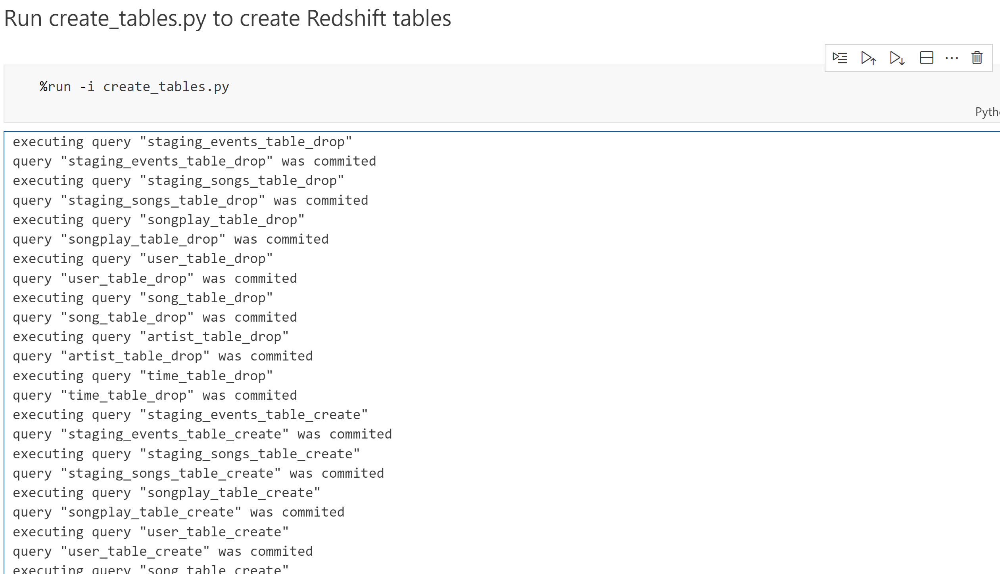

## Udacity Data Engineering Nanodegree

## Project 2 - Data Warehouse

### Project Description

In the project 2 - Data Warehouse, we'll build an ETL pipeline for a database hosted on Redshift.

The music streaming startup Sparkify has grown their user base and song database and want to move their processes and data onto the cloud. Their data resides in S3, in a directory of JSON logs on user activity on the app, as well as a directory with JSON metadata on the songs in their app.

The Goal of our project is building an ETL pipeline that extracts their data from S3, stages them in Redshift then transforms data into a set of dimensional tables for their analytics team to continue finding insights into what songs their users are listening to.

|  |
| :------------------------------------------------------------------------------------------------------------------: |
|                                    _System Architecture - AWS S3 to RedShift ETL_                                    |

---

### Project dataset:

we'll be working with two datasets stored in S3 links:

- Song data: `s3://udacity-dend/song_data`
- Lod data: `s3://udacity-dend/log_data`

To properly read log data `s3://udacity-dend/log_data`, we need the following metadata file:

- Log metadata: `s3://udacity-dend/log_json_path.json`

```
Note: `udacity-dend` bucket is situated in the `us-west-2` region.
```

### Song Dataset

Dataset is a subset of real data from the [Million Song Dataset](http://millionsongdataset.com/). Each file is in JSON format and contains metadata about a song and the artist of that song.

```
[song_data/A/A/A/TRAAAAK128F9318786.json](sample_data/TRAAAAK128F9318786.json)
```

The example for the content of a song file, TRAAAAK128F9318786.json:

```
{"artist_id":"ARJNIUY12298900C91","artist_latitude":null,"artist_location":"","artist_longitude":null,"artist_name":"Adelitas Way","duration":213.9424,"num_songs":1,"song_id":"SOBLFFE12AF72AA5BA","title":"Scream","year":2009}
```

### Log Dataset

Second dataset consists of log files in JSON format generated by this event simulator(opens in a new tab) based on the songs in the dataset above. These simulate app activity logs from an imaginary music streaming app based on configuration settings.
For example:

```
log_data/2018/11/2018-11-12-events.json
log_data/2018/11/2018-11-13-events.json
```

|  |
| :---------------------------------------------------------------------------------: |
|                                     _log_data_                                      |

### Log JSON Metadata

The [log_json_path.json](./sample_data/log_json_path.json) file is used when loading JSON data into Redshift. It specifies the structure of the JSON data so that Redshift can properly parse and load it into the staging tables. [log_json_path.json](./sample_data/log_json_path.json) file tells Redshift how to interpret the JSON data and extract the relevant fields. This is essential for further processing and transforming the data into the desired analytics tables.

|  |
| :-----------------------------------------------------------------------: |
|                     _Content of `log_json_path.json`_                     |

---

### Project Steps

##### 1. Create Table Schema

1. Design Schemas for the fact and dimemsion tables.
2. Write a SQL `CREATE`statement for each of these tables in [sql_queries.py](sql_queries.py).
3. Complete the logic in [create_tables.py](create_tables.py) to connect to the database and create these tables.
4. Write the `DROP` statements to drop the tables in the beginning of [create_tables.py](create_tables.py)if the table aldready exist.This way, we can run [create_tables.py] wheneverwe wantto resetour databaseand test ETL pipeline.
5. Launch redshift cluster and create a IAM role that has read access to s3.
   - IAM role: `project2RedshiftRole`
6. Add redshift cluster and IAM role info to [dwh.cfg](dwh.cfg).
7. Test by running [create_tables.py](create_tables.py) and checkingthe table schemas in the redshift database. We can use QueryEditor in AWS RedShift console for this.

#### 2. Build ETL Pipeline

1. Implement the logic in [etl.py](etl.py) to load data from S3 to staging tables on RedShift.
2. Implement the logic in [etl.py](etl.py) to load data from staging tables to analytics tables on RedShift.
3. Test by running [etl.py](etl.py) after running [create_tables.py](create_tables.py) and running the analytic queryon the RedShift database to compare the result with the expected results.
4. Delete RedShift cluster when finished.

---

### IAC to create and remove all of infras

- With Notebook use the [iac.py](iac.py) script and config file [iac.cfg](iac.cfg) to create/remove IAM Role and RedShift cluster easily.

|  |
| :-----------------------------------------------------------------: |
|                       _config file `iac.cfg`_                       |

---

### Schema for Song Play Analysis.

Using the song and event datasets, we'll need to create a star schema optimized for queries on song play analysis. This includes the following tables.

Fact table:

> 1. _songplays_: records in event data associated with song plays i.e. records with page `NextSong`
>
> ```
> Columns: songplay_id, start_time, user_id, level, song_id, artist_id, session_id, location, user_agent
> ```

Dimension table:

> 1. _users_ - users in the app.
>
> ```
> Columns: user_id, first_name, last_name, gender, level
> ```

> 2. _songs_ - songs in music databas
>
> ```
> Columns: song_id, title, artist_id, year, duration
> ```

> 3.  _artists_ - artists in music database
>
> ```
> Columns: artist_id, name, location, lattitude, longitude
> ```

> 4. _time_ - timestamps of records in songplays broken down into specific units
>
> ```
> Columns: start_time, hour, day, week, month, year, weekday
> ```

|  |
| :------------------------------------------------------------------------------------: |
|                                    _Table schemas_                                     |

---

### How to run

For the practicing purpose we will use jupyter notebook to run step by step of project processing:
[data-warehouse-project.ipynb](data-warehouse-project.ipynb)

##### 1. Create cloud IamRole


##### 2. Create RedShift cluster


##### 3. Run create_tables.py



##### 4. Run elp.py


##### 4. Validate Success on RedShift:

- _Top 10 staging_events_  
  
  ***
- _Top 10 staging_song_  
  
  ***
- _Top 10 songplays_  
  
  ***
- _Top 10 songs_  
  
  ***
- _Top 10 users_  
  
  ***
- _Top 10 artists_  
  
  ***
- _Top 10 time_  
  
