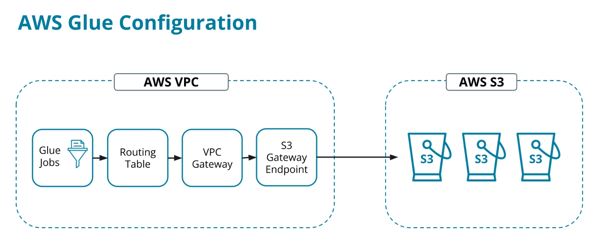
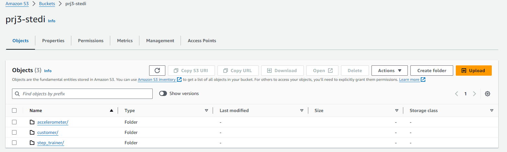
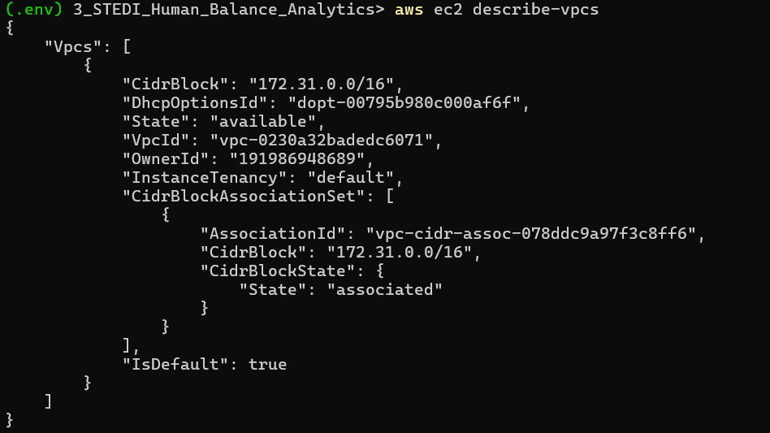
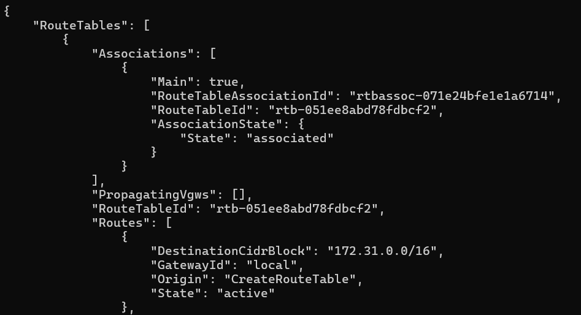
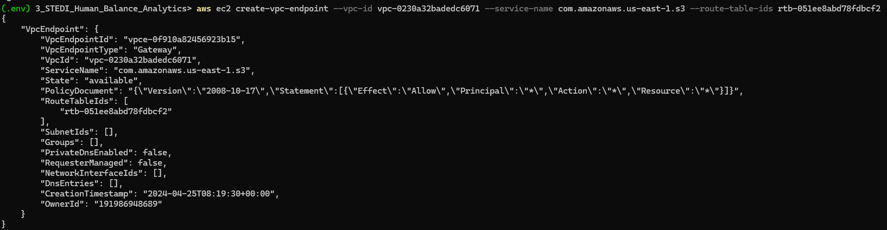
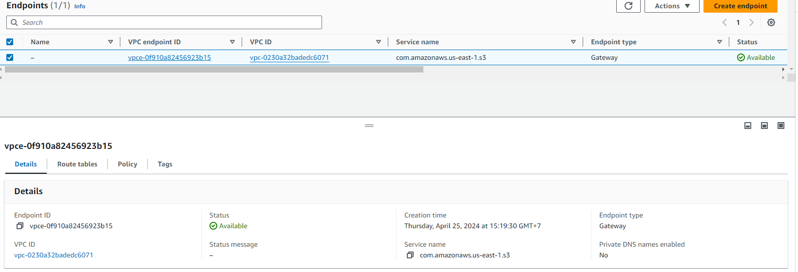
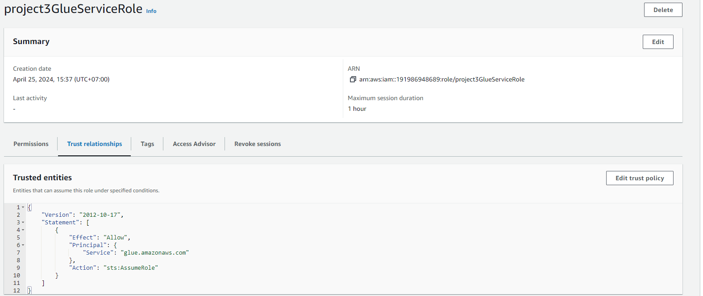
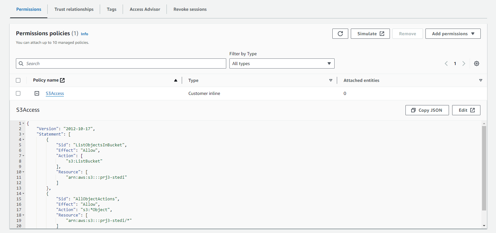
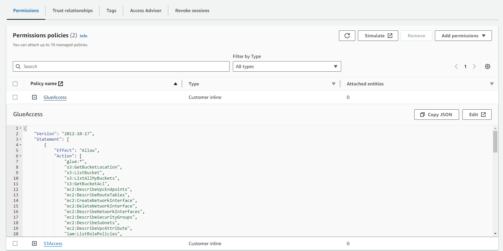

## AWS GLUE Configuration



### 1. Create bucket and  update landing data store to s3
```
aws s3 mb s3://prj3-stedi
aws s3 cp .\starter\ s3://prj3-stedi/ --recursive --exclude "*.md"
```


``` 
#### Create VPC endpoint
aws ec2 describe-vpcs
```


```
aws ec2 describe-route-tables
```


```
aws ec2 create-vpc-endpoint --vpc-id vpc-0230a32badedc6071 --service-name com.amazonaws.us-east-1.s3 --route-table-ids rtb-051ee8abd78 fdbcf2
```




### 2. Creating the Glue Service Role
Create project3GlueServiceRole with Trusted Policy [glue_trusted_policy.json](iam_role/glue_trusted_policy.json)
```
aws iam create-role --role-name project3GlueServiceRole --assume-role-policy-document file://iam_role/glue_trusted_policy.json
```



Grant Glue Privileges on the S3 Bucket [s3_data_source_access_policy.json](iam_role/s3_data_source_access_policy.json)
```
aws iam put-role-policy --role-name project3GlueServiceRole --policy-name S3Access --policy-document file://iam_role/s3_data_source_access_policy.json
```



Last, we need to give project3GlueServiceRole access to data in special S3 buckets used for Glue configuration, and several other resources.
```
aws iam put-role-policy --role-name project3GlueServiceRole --policy-name GlueAccess --policy-document file://iam_role/glue_resources_access_policy.json
```
