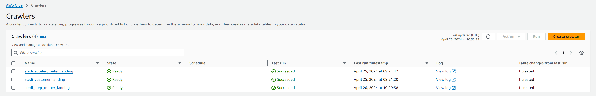
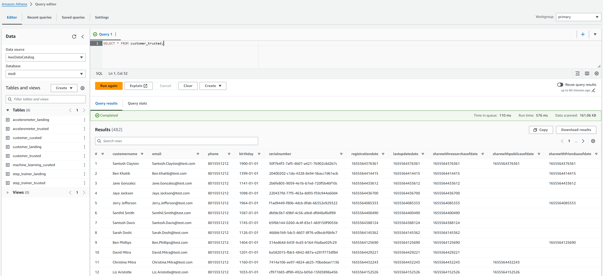

## Overview

In this project, we'll act as a data engineer for the STEDI team to build a data lakehouse solution for sensor data that trains a machine learning model.

## Project Details

The STEDI Team has been hard at work developing a hardware STEDI Step Trainer that:

- Trains the user to do a STEDI balance exercise;
- Sensors on the device that collect data to train a machine-learning algorithm to detect steps.
- A companion mobile app that collects customer data and interacts with the device sensors.

STEDI has heard from millions of early adopters who are willing to purchase the STEDI Step Trainers and use them.

Several customers have already received their Step Trainers, installed the mobile application, and begun using them together to test their balance. The Step Trainer is just a motion sensor that records the distance of the object detected. The app uses a mobile phone accelerometer to detect motion in the X, Y, and Z directions.

The STEDI team wants to use the motion sensor data to train a machine learning model to detect steps accurately in real-time. Privacy will be a primary consideration in deciding what data can be used.

Some of the early adopters have agreed to share their data for research purposes. Only these customers’ Step Trainer and accelerometer data should be used in the training data for the machine learning model.

#### What is Landing Zone

- The data coming from the various sources, you will need to create your own S3 directories for customer_landing, step_trainer_landing, and accelerometer_landing zones.

#### What is Trusted Zone

- Sanitize the Customer data from the Website (Landing Zone) and only store the Customer Records who agreed to share their data for research purposes (Trusted Zone) - creating a Glue Table called customer_trusted.

- Sanitize the Accelerometer data from the Mobile App (Landing Zone) - and only store Accelerometer Readings from customers who agreed to share their data for research purposes (Trusted Zone) - creating a Glue Table called accelerometer_trusted.

#### What is Curated Zone

- Sanitize the Customer data (Trusted Zone) and create a Glue Table (Curated Zone) that only includes customers who have accelerometer data and have agreed to share their data for research called customers_curated.

- The Step Trainer IoT data stream (S3) and populate a Trusted Zone Glue Table called step_trainer_trusted that contains the Step Trainer Records data for customers who have accelerometer data and have agreed to share their data for research (customers_curated).

- An aggregated table that has each of the Step Trainer Readings, and the associated accelerometer reading data for the same timestamp, but only for customers who have agreed to share their data, and make a glue table called machine_learning_curated.

## 1. Landing Zone

#### Glue Cralwers to create landing zone table automatically.

#### SQL DDL scripts:

- [customer_landing.sql](./table_DDL/customer_landing.sql)
- [accelerometer_landing.sql](./table_DDL/accelerometer_landing.sql)
- [step_trainer_landing.sql](./table_DDL/step_trainer_landing.sql)

Size of customer_landing: 956 rows

Size of accelerometer_landing: 81,273 rows

Size of step_trainer_landing: 28,680 rows

The customer_landing data contains multiple rows with a blank shareWithResearchAsOfDate

## 2. Trusted Zone

### [customer_landing_to_trusted.py](./glue_py/customer_landing_to_trusted.py)

Size of customer_trusted: 482 rows

### [accelerometer_landing_to_trusted.py](./glue_py/accelerometer_landing_to_trusted.py)

Size of accelerometer_trusted: 40,981 rows

## 3. Curated Zone

### [customer_trusted_to_curated.py](./glue_py/customer_trusted_to_curated.py)

Size of customer_curated: 482 rows (means all customers have accelerometer data)

### [step_trainer_trusted.py](./glue_py/step_trainer_trusted.py)

Size of step_trainer_trusted: 14,600 rows

### [machine_learning_curated.py](./glue_py/machine_learning_curated.py)

Size of machine_learning_curated: 43,681 rows

