# Datasets

For this project, we'll be working with two datasets and a json_fotmat file. The s3 links for each:

- Log data: `s3://udacity-dend/log_data`
- Song data: `s3://udacity-dend/song_data`
- Json format file: `s3://udacity-dend/log_json_path`

# Copy S3 Data

The data for the next few exercises is stored in Udacity's S3 bucket. This bucket is in the US West AWS Region. To simplify things, we are going to copy the data to our bucket `s3://fuong-cao/` so Redshift can access the bucket.
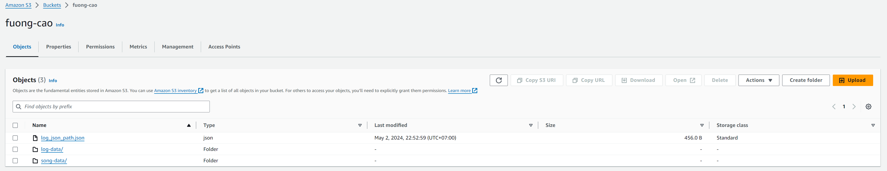

# Project Overview

## Start project on workspace

To start airflow services and environments, run below in terminal. Due to `airflow scheduler --daemon` not work so run `airflow scheduler` instead.

```
start-airflow/start-services.sh
start-airflow/start.sh
start-airflow/create-user.sh
start-airflow/set_connections.sh
airflow scheduler
```

Sign in Aiflow with `user: admin / pass: admin`
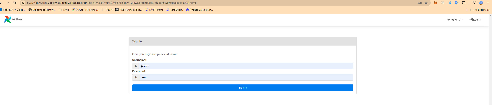

the project workspace structure:

```
--Final Project Dags--
aiflow/dags/project-data-pipelines/final_project.py
aiflow/dags/project-data-pipelines/final_project_create_table.py

--Final Project Helper--
aiflow/plugins/final_project_helpers/table_create_statements.py
aiflow/plugins/final_project_helpers/sql_statements.py

--Final Project Operater--
aiflow/plugins/final_project_operators/data_quality.py
aiflow/plugins/final_project_operators/load_dimension.py
aiflow/plugins/final_project_operators/load_fact.py
aiflow/plugins/final_project_operators/stage_redshift.py
```

# Airlow DAG:

## Sub DAG to create tables:

- staging_events
- staging_songs
- songplays
- songs
- users
- artists
- time

[aiflow/dags/project-data-pipelines/final_project_create_table.py](airflow/dags/project-data-pipelines/final_project_table_create.py)  
[aiflow/plugins/final_project_helpers/table_create_statements.py](airflow/plugins/final_project_helpers/table_create_statements.py)  
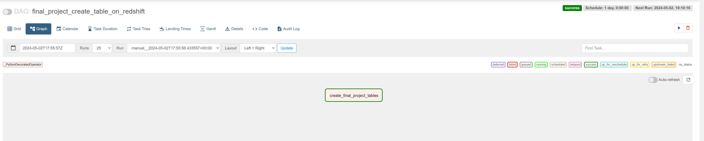

final_project_create_table_on_redshift logs
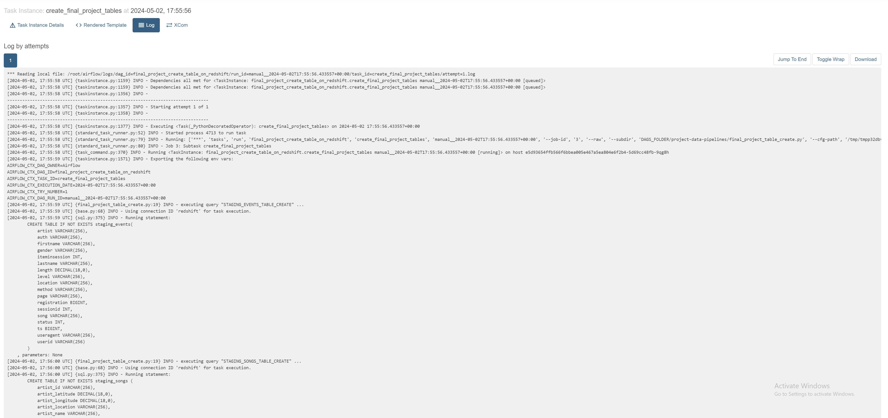

In the DAG, add `default parameters` according to these guidelines

- The DAG does not have dependencies on past runs
- On failure, the task are retried 3 times
- Retries happen every 5 minutes
- Catchup is turned off
- Do not email on retry

[aiflow/dags/project-data-pipelines/final_project.py](airflow/dags/project-data-pipelines/final_project.py)

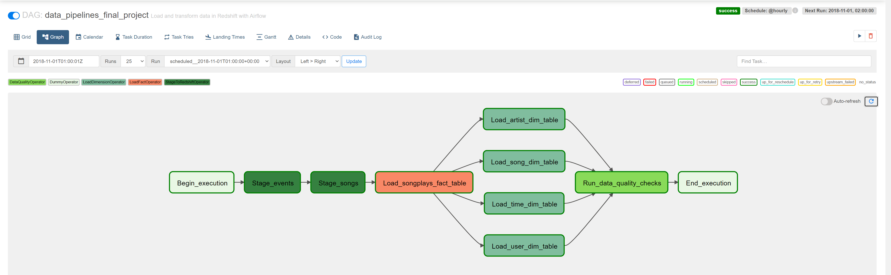

## Stage Operator

[aiflow/plugins/final_project_operators/stage_redshift.py](airflow/plugins/final_project_operators/stage_redshift.py)

stage_events log
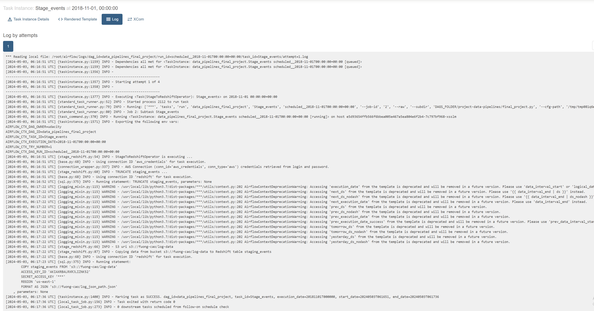

stage_songs log
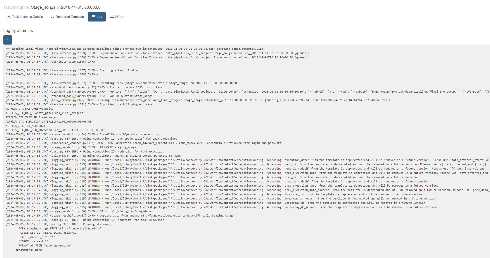

## Fact Operators

[aiflow/plugins/final_project_operators/load_fact.py](airflow/plugins/final_project_operators/load_fact.py)  
Load_songplays_fact_table logs
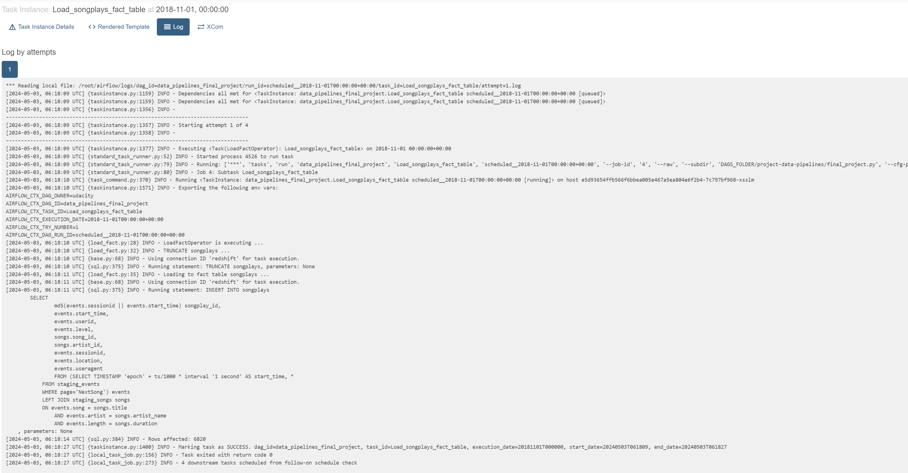

## Dimension Operators

[aiflow/plugins/final_project_operators/load_dimension.py](airflow/plugins/final_project_operators/load_dimension.py)

1. Load_artist_dim_table logs
   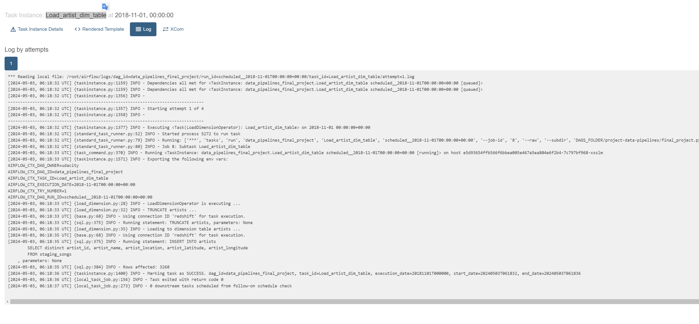

2. Load_song_dim_table logs
   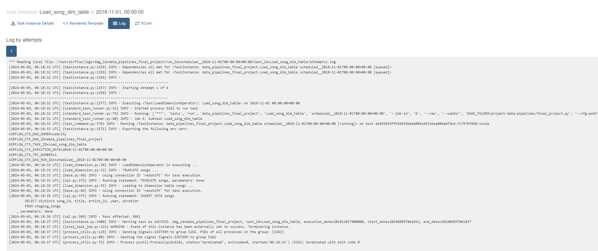

3. Load_user_dim_table logs
   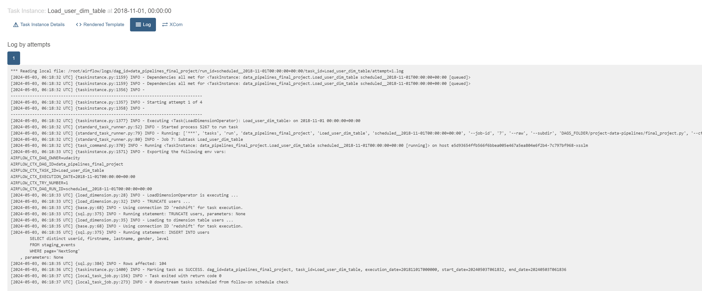

4. Load_time_dim_table logs
   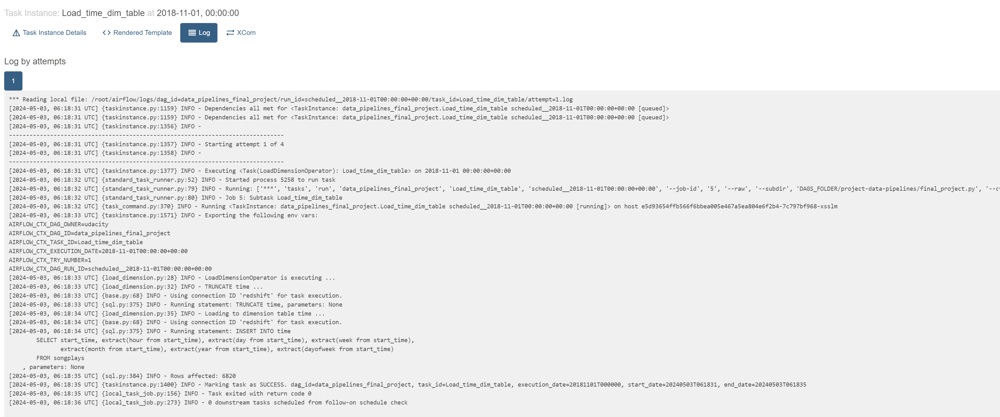

## Data Quality Operator

[aiflow/plugins/final_project_operators/data_quality.py](airflow/plugins/final_project_operators/data_quality.py)  
Run_data_quality_checks logs
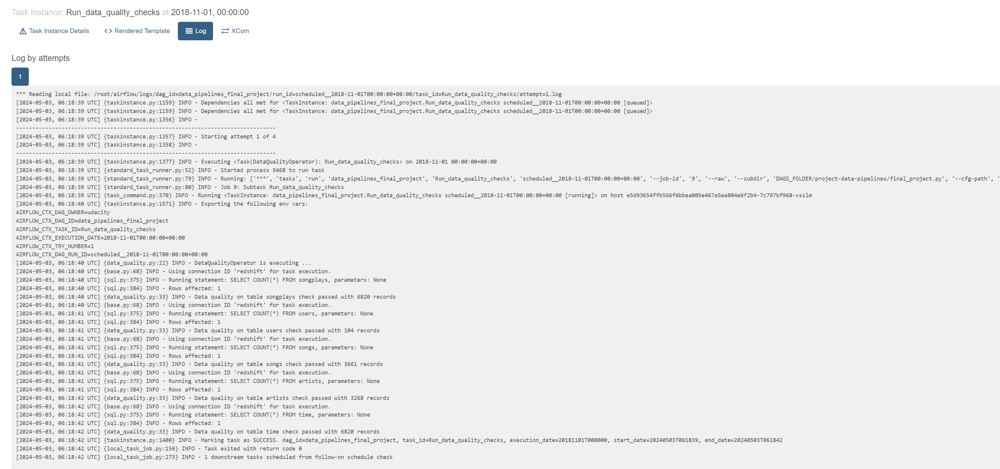

## Query Redshift:

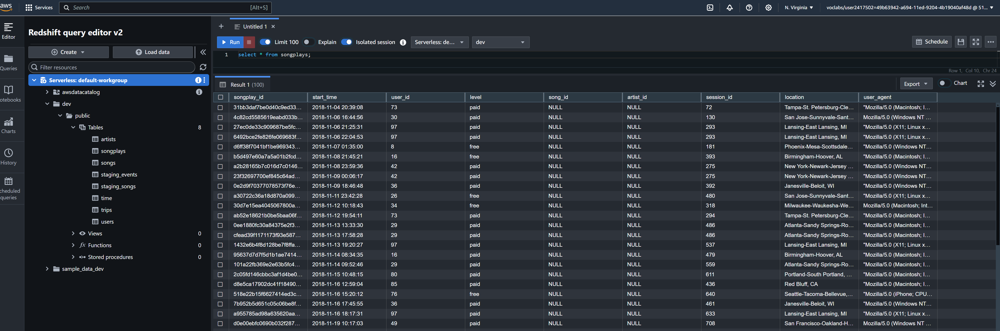
